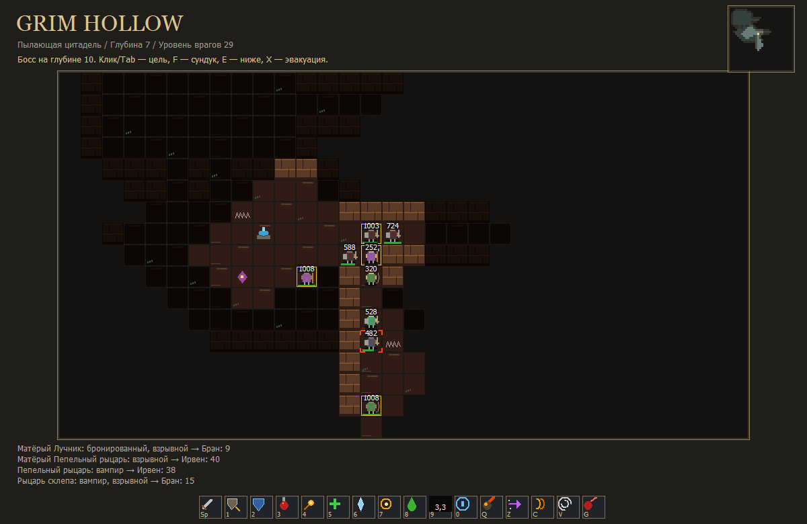
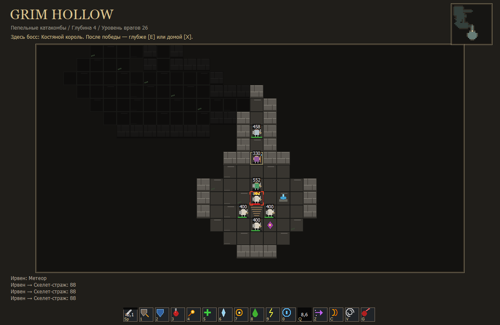
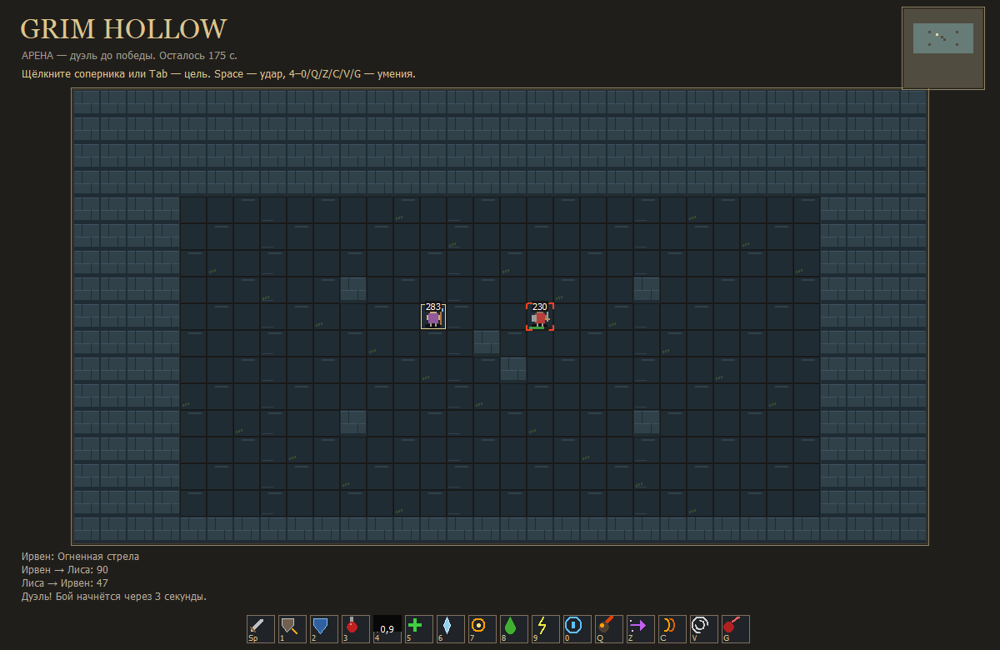
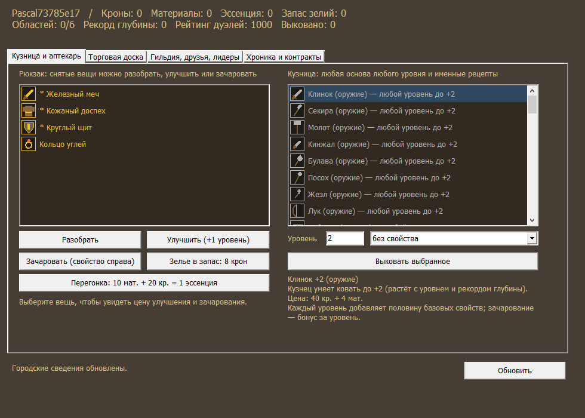
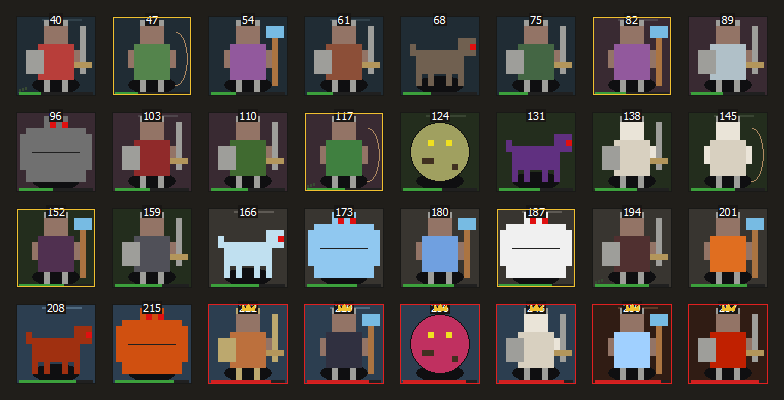
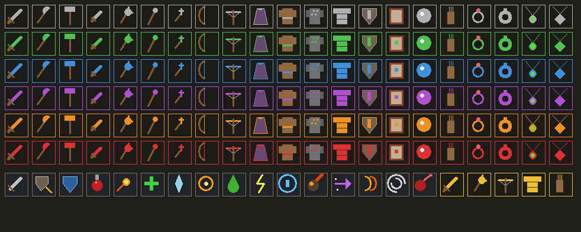
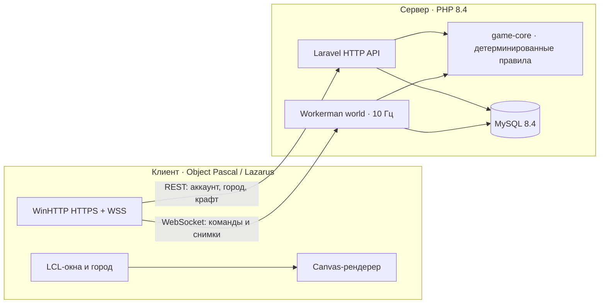

<div align="center">

# ⚔️ Grim Hollow

### Бездонная глубина · кооперативный рогалик на Object Pascal и PHP

Спускайтесь в бесконечные процедурные подземелья вчетвером, собирайте и куйте снаряжение,<br>
сражайтесь с тысячами вариаций чудовищ и выясняйте, кто сильнее, на арене.

[](https://github.com/villetacore/grim-hollow/actions/workflows/verify.yml)
[](https://github.com/villetacore/grim-hollow/releases/latest)
[](LICENSE)




**[Скачать](https://github.com/villetacore/grim-hollow/releases/latest)** ·
**[Руководство игрока](docs/17-player-guide.md)** ·
**[Запуск сервера](docs/16-distribution.md)** ·
**[Что нового](CHANGELOG.md)**

</div>

---

## ✨ Что внутри

<table>
<tr>
<td width="50%" valign="top">

### 🕳️ Бесконечная глубина
Этажи не кончаются. Каждые 3–5 этажей выход стережёт босс, после него враги соседних областей смешиваются, а боссы чередуются. Шесть областей: от затопленных шахт до пылающей цитадели.

### 📈 Сложность по группе
Уровень врагов = **средний уровень группы + глубина**. Сильная команда сразу встречает сильных врагов, награда растёт вместе с опасностью. 100 уровней героя, рекорды глубины и таблица лидеров.

### 👹 Тысячи вариаций врагов
32 вида существ × 12 свойств (яд, лёд, вампиризм, берсерк, взрыв, шаман…), до трёх на одном враге, × 5 видов групп: одиночки, стаи, отряды, ковены с лекарем. Матёрые враги и боссы с призывом и ударом по площади.

</td>
<td width="50%" valign="top">

### ⚒️ Процедурное снаряжение
21 основа, любой уровень, 8 зачарований (включая крит и вампиризм) плюс 47 именных вещей. Кузница куёт, улучшает на +1 и перезачаровывает. Добыча подстраивается под класс героя.

### 🎯 Тактический бой
12 заклинаний с собственными перезарядками, цель выбирается мышью или Tab, огненная волна и скачок летят по направлению взгляда. Броня поглощает долю урона, есть криты и вампиризм.

### 🤺 Дуэли
Арена один на один: бой до победы или ничьей через 3 минуты. Рейтинг Эло, счёт побед и таблица лучших дуэлянтов. Золото и вещи на арене не меняются.

</td>
</tr>
</table>

Ещё: четыре класса (Страж, Арканист, Следопыт, Хранитель), до восьми героев на аккаунт, поднятие павших союзников, сундуки, родники, алтари и ловушки, туман войны, доска контрактов, эссенция и перегонка, торговая доска с escrow, гильдии, друзья, три канала чата и модерация.

## 🖼️ Галерея

<table>
<tr>
<td><br><sub><b>Босс каждые 3–5 этажей.</b> Костяной король призывает скелетов, метеор бьёт по площади.</sub></td>
<td><br><sub><b>Арена.</b> Дуэль один на один с рейтингом Эло.</sub></td>
</tr>
<tr>
<td><br><sub><b>Кузница.</b> Любая основа любого уровня, улучшение и зачарование.</sub></td>
<td><br><sub><b>Бестиарий.</b> 26 видов врагов и 6 боссов, у каждой области свой набор.</sub></td>
</tr>
</table>

<div align="center">
<br>
<sub>Иконки снаряжения меняют цвет с уровнем (серый → зелёный → синий → фиолетовый → оранжевый → красный, золото — именные вещи) и 16 умений панели действий.</sub>
</div>

> Все изображения рисует настоящий рендерер клиента по состояниям игрового ядра: `tools/screenshots/make.ps1`.

## 🚀 Играть

1. Скачайте клиент для своей системы на странице **[Releases](https://github.com/villetacore/grim-hollow/releases/latest)** и распакуйте архив.
2. Запустите `GrimHollow.exe` (Windows) или `./grim-hollow` (Linux).
3. Введите адрес сервера, который дал организатор, создайте аккаунт и героя.
4. **Поход** → область → «Подготовить» → передайте код друзьям → «Начать».

### 🎮 Управление

| Клавиша | Действие | Клавиша | Действие |
| --- | --- | --- | --- |
| <kbd>W</kbd><kbd>A</kbd><kbd>S</kbd><kbd>D</kbd> / стрелки | шаг | <kbd>Space</kbd> | атака цели |
| щелчок / <kbd>Tab</kbd> | выбрать цель | правый щелчок | ударить сразу |
| <kbd>1</kbd> <kbd>2</kbd> <kbd>3</kbd> | щитовой удар, защита, зелье | <kbd>4</kbd>–<kbd>0</kbd> | заклинания |
| <kbd>Q</kbd> <kbd>Z</kbd> <kbd>C</kbd> <kbd>V</kbd> <kbd>G</kbd> | метеор, скачок, волна, вихрь, похищение жизни | <kbd>F</kbd> | сундук, родник, алтарь |
| <kbd>E</kbd> | спуститься глубже | <kbd>X</kbd> | вернуться с добычей |
| <kbd>R</kbd> | поднять союзника | <kbd>T</kbd> / <kbd>F1</kbd> | город / справочник |

## 💻 Платформы

| Платформа | Статус | Примечание |
| --- | --- | --- |
| Windows 10/11 x64 | ✅ основная | HTTPS + WebSocket (WinHTTP), системная проверка сертификатов |
| Windows 7 / Vista x64 | ✅ поддерживается | тот же клиент: без WinHTTP WebSocket работает через HTTPS-опрос. На Win7 нужен TLS 1.2 (обновление KB3140245) |
| Windows XP / Vista / 7 x86 | 🧪 экспериментально | отдельная 32-битная сборка (Lazarus 2.2.6). XP не поддерживает современный TLS, поэтому играет с локальным сервером или сервером в домашней сети по HTTP |
| Linux x64 (GTK2) | ✅ | локальный HTTP-сервер |
| Android | 🗺️ планируется | нативный клиент на Free Pascal, см. [дорожную карту](docs/11-roadmap.md) |

Клиент по HTTP подключается только к локальному серверу (`127.0.0.1`) или к серверу в частной сети (`10.x`, `172.16–31.x`, `192.168.x`). Ко всем остальным адресам — только HTTPS.

## 🛠️ Сборка из исходников

Нужны Docker Desktop (Linux containers) или Docker Engine + Compose v2, а для клиента — Lazarus 2.2.6+ с FPC 3.2.2.

```powershell
./tools/setup.ps1          # сервер: MySQL, API, мир — http://127.0.0.1:8080
./tools/build-client.ps1   # клиент Windows → dist/windows/GrimHollow.exe
./tools/play.ps1           # запустить игру (или двойной щелчок по Play.cmd)
```

Linux: `sh tools/setup.sh`, клиент — проект `apps/client/GrimHollow.lpi` или `infra/docker/client/Dockerfile`.

<details>
<summary><b>Проверки</b></summary>

```powershell
./tools/test-mysql.ps1                 # 59 тестов PHP на MySQL
./tools/test-client.ps1                # GUI smoke Windows-клиента
node tests/e2e/smoke.mjs               # HTTP/WebSocket, два аккаунта
node tests/e2e/gameplay.mjs            # бот проходит этаж и эвакуируется
python tools/release.py check
python -m unittest discover -s tests/packaging
```

При каждом push GitHub Actions проверяет сервер, собирает клиенты Windows и Linux и прогоняет GUI- и сетевые сценарии. Тег `vX.Y.Z` публикует релиз и образ `ghcr.io/villetacore/grim-hollow`.
</details>

## 🧱 Архитектура



Сервер авторитетен: клиент только отправляет намерения и рисует снимки. Мир продвигает все походы одной транзакцией за такт, держит состояние в памяти и отправляет снимок только при изменении вида. Ранние команды буферизуются, а клиент предсказывает свой шаг, поэтому управление отзывчиво даже с пингом. Экономика транзакционна, каждый поход можно воспроизвести по журналу событий (`php artisan game:verify-replay`).

| Каталог | Содержание |
| --- | --- |
| [`apps/client`](apps/client) | клиент: Object Pascal, Lazarus, LCL Canvas |
| [`apps/server`](apps/server) | Laravel 13 HTTP API, Workerman world, тесты |
| [`packages/game-core`](packages/game-core) | детерминированные правила, генерация, каталог контента |
| [`infra`](infra) | Docker, MySQL, Nginx, Caddy, Compose |
| [`tools`](tools) | запуск, сборка, упаковка релизов, скриншоты |
| [`tests`](tests) | сетевые сценарии, игровой бот, упаковка |
| [`docs`](docs) | руководства, архитектура, дизайн, статус |

## 📚 Документация

[Руководство игрока](docs/17-player-guide.md) · [Статус реализации](docs/00-implementation-status.md) · [Сборка и запуск](docs/13-running.md) · [Распространение и свой сервер](docs/16-distribution.md) · [Архитектура](docs/05-architecture.md) · [Дорожная карта](docs/11-roadmap.md)

## 🤝 Участие

Issues и pull requests приветствуются. Прочитайте [CONTRIBUTING.md](CONTRIBUTING.md), об уязвимостях сообщайте по [SECURITY.md](SECURITY.md).

## 📄 Лицензия

Код распространяется под лицензией [MIT](LICENSE). Графика собственная и рисуется кодом; ресурсы сторонних игр не используются. [Сторонние компоненты](THIRD_PARTY_NOTICES.md) сохраняют свои лицензии.
