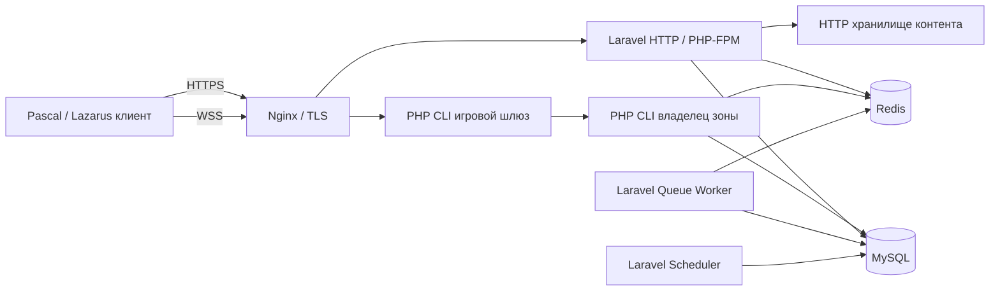

# 05. Серверная архитектура

## Стек и границы ответственности

Начальная архитектура — модульный монолит в одном репозитории и несколько типов процессов. Laravel отвечает за аккаунты, метаигру, экономику, управление сеансами и административный интерфейс. Чистая PHP-библиотека содержит правила боя и генерацию. Долгоживущие CLI-процессы выполняют игровые такты. Pascal отвечает за клиент, инструменты и представление состояния.

Выбранная база: PHP 8.4 + Laravel 13, MySQL 8.4 LTS, Redis 7.4, Nginx, Docker Compose на Linux. Библиотека WebSocket/event loop выбирается техническим прототипом; кандидат — Workerman. Точные версии пакетов, расширений, Lazarus/FPC и библиотек клиента фиксируются в lock-файлах и сборочном манифесте после проверки совместимости. Набор версий здесь — архитектурный выбор, а не уже протестированная поставка.

На первом этапе шлюз и владелец зоны работают в одном CLI-процессе. Выделение шлюза в отдельный процесс происходит при необходимости маршрутизации между узлами, без изменения клиентских команд. Laravel bootstrap выполняется один раз; состояние игрока не хранится в singleton HTTP-сервисах. Боевые циклы не исполняются в PHP-FPM запросах или обычных фоновых job.

## Модули приложения

| Модуль | Владеет | Не должен делать |
| --- | --- | --- |
| Identity | Аккаунты, устройства, сессии, ограничения | Выдавать игровые предметы |
| Characters | Персонажи, постоянная экипировка, таланты | Исполнять боевые такты |
| World | Зоны, размещение процессов, переходы | Рассчитывать цены рынка |
| Expeditions | Жизненный цикл забега, участники, завершение | Самостоятельно менять кошелёк SQL-запросом |
| Combat | Детерминированные правила и AI | Обращаться к HTTP, ORM, Redis |
| Inventory | Владение, перемещение, стеки предметов | Доверять клиентскому описанию вещи |
| Economy | Кошельки, проводки, ремесло, торговая доска | Выдавать награду без уникального основания |
| Social | Группы, гильдии, друзья, чат | Разрешать вход без проверки состава группы |
| Content | Опубликованные определения и версии | Менять активный забег задним числом |
| Operations | Жалобы, аудит, управление сервером | Обходить доменные инварианты |

Каждый модуль содержит Domain, Application, Infrastructure и Interfaces. Domain зависит только от своих типов и явно выделенных общих примитивов; Application — от портов; Infrastructure реализует порты через MySQL, Redis и транспорт. Контроллеры вызывают сценарий использования и форматируют ответ. Общая библиотека не превращается в место для произвольной бизнес-логики.

## Владелец состояния

Для каждой зоны/экспедиции существует один активный владелец записи. Его память содержит сетку, сущности, очереди действий, AI и состояние генераторов. MySQL хранит подтверждённый журнал команд/событий и контрольные снимки; Redis — присутствие, маршрутизацию, короткие очереди и кэш. Потеря Redis не должна уничтожать подтверждённые предметы или награды.

Назначение владельца хранится в MySQL с возрастающим `owner_epoch` и сроком аренды. Продление использует время БД. Новый процесс получает новый epoch через compare-and-swap транзакцию. Каждая запись журнала и финализация проверяет текущий epoch; шлюз принимает события только от текущего владельца. Старый процесс при потере аренды прекращает подтверждать действия. Redis-lock может ускорять координацию, но не является единственной защитой от двух владельцев.

## Надёжность симуляции

Для первой версии выбран простой режим: результаты такта становятся внешне подтверждёнными только после фиксации журнала в MySQL. Группа событий такта записывается одной транзакцией с уникальными `(instance_id, event_seq)`. Состояние в памяти обновляется до публикации, но при неуспешной записи откатывается к последнему подтверждённому такту и цикл приостанавливается. На клиент не уходит неподтверждённая награда или окончательный урон.

Снимок сохраняется каждые 5 секунд и на переходах этажа. Восстановление: последний снимок + последующие события в порядке `event_seq`. Снимок включает tick, RNG states, content version и owner epoch; событие содержит достаточно данных для восстановления без повторной случайной генерации. Физически удалять журнал до подтверждения пригодного снимка запрещено. Завершённые подробные журналы хранятся 14 дней; финансовый аудит сохраняется отдельно дольше.

Цена решения — запись активных тактов в БД и дополнительная задержка подтверждения. В прототипе нужно измерить её при 100 CCU. Если бюджет не выдержан, следующий этап — отдельный долговечный журнал, а не незаметное ослабление гарантий. Во время недоступности MySQL симуляция останавливается; игрок получает состояние `server_paused`.

## Завершение забега и выдача награды

Состояния экспедиции: `created → allocating → active → settling → completed|failed`; `recovering` временно заменяет `active`, `cancelled` используется до начала или при подтверждённой невосстановимости. Состояния участника: `active → extracted|defeated|abandoned`; у каждого отдельное закрепление награды.

Одна транзакция финализации участника блокирует его запись и персонажа, проверяет текущего владельца и подтверждённые события, создаёт settlement с уникальным `(expedition_id, character_id)`, меняет инвентарь/опыт/валюту и пишет outbox. Повтор операции возвращает существующий результат. Общий результат экспедиции закрывается после финализации всех участников.

Outbox читается фоновой задачей: уведомления и индексы могут обновиться позже. Доставка события — как минимум один раз, потребители дедуплицируют `event_id`. Не обещаем «exactly once» для сети; однократный экономический эффект обеспечивается транзакцией и уникальными ключами.

## Переходы и переподключение

Персонаж имеет одну активную запись присутствия. При входе в экспедицию фиксируются loadout и резервирование расходников; параллельное изменение инвентаря через HTTP блокируется. Переход между зонами: `prepare` в источнике → создание destination ticket → `commit` назначения → отключение источника. Время жизни тикета ограничено; истечение до commit возвращает исходное состояние.

При разрыве связи сессия ждёт 120 секунд. За это время герой остаётся в симуляции, после срока получает `abandoned` и поражение участника. Новое соединение того же аккаунта заменяет старое с увеличением `connection_generation`; команды старого соединения отклоняются. Восстановление отправляет новый snapshot и текущую последовательность команд.

## Масштабирование

Сначала: один Linux-узел приложения, один MySQL, один Redis. Затем отдельная БД и несколько игровых узлов; новые зоны распределяются по памяти, задержке тактов и числу участников. Живую миграцию занятого боя в первой версии не делаем. При выкладке узел перестаёт принимать новые экспедиции и завершает текущие.

Разбиение MySQL по регионам рассматривается после измерений и проверки восстановления. Kafka, Kubernetes, отдельные сервисы на каждую сущность и глобальная распределённая транзакция не нужны для первого среза.
